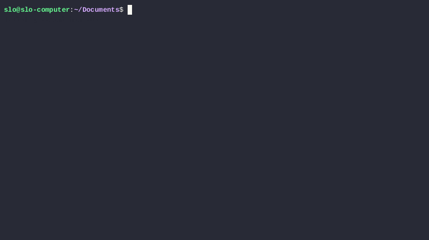

# UAC-TriageX

<p align="center">
  <strong> Professional Bash wrapper acting as orchestration for UAC</strong><br>
  A Bash wrapper that prepares the workspace, validates the collector, captures context, runs UAC, and records operator metadata in a repeatable way.
</p>

<p align="center">
  
  
  
  
</p>

---

## Overview

This repository contains a hardened wrapper around **UAC (Unix-like Artifacts Collector)** for Linux triage collection.

The goal is simple: make UAC easier to run in a professional, repeatable, case-friendly way.

Instead of manually creating folders, tracking metadata, validating profiles, capturing pre-triage context, and remembering exact command lines, [`triage.sh`](./triage.sh) does that for you.

It is especially useful when you want:

- A consistent operator workflow
- Clear case and evidence metadata
- A documented command trail
- Pre- and post-collection notes
- Safer handling of output and temporary directories
- A more polished experience for incident response operations

> This project is a wrapper around UAC. It is not a replacement for the upstream collector itself.

## Demo

<p align="center">
  
</p>

## About UAC

**UAC (Unix-like Artifacts Collector)** is the upstream incident response and forensic artifact collection project maintained at:

- [tclahr/uac on GitHub](https://github.com/tclahr/uac)

UAC is the engine that actually performs the collection. This wrapper adds operator workflow, metadata capture, context collection, logging, and safer execution around it.

## Install UAC For This Wrapper

The wrapper expects the extracted UAC directory to be available in the **same directory** as [`triage.sh`](./triage.sh), using this layout:

```text
.
|-- triage.sh
`-- uac/
```

Recommended setup:

1. Download UAC from the upstream GitHub repository or release page
2. Extract it
3. Place the extracted folder next to [`triage.sh`](./triage.sh)
4. Ensure the launcher is available at `./uac/uac`

Example:

```bash
chmod +x triage.sh
chmod +x uac/uac
```

If UAC is stored somewhere else, you can still use the wrapper with:

```bash
sudo ./triage.sh --uac-dir /path/to/uac ...
```

## What The Script Does

[`triage.sh`](./triage.sh) turns a raw UAC run into a guided workflow:

1. Prompts for required case metadata if missing
2. Displays a configuration summary before execution
3. Creates a destination structure for output, temp data, transcripts, and notes
4. Validates the local UAC extraction and selected profile
5. Captures minimal system context before collection
6. Runs UAC from its extracted directory with the selected options
7. Records a redacted command log and execution transcript
8. Hashes resulting archives and appends them to case notes
9. Saves profile validation errors to `uac-output/uac_validation.txt` when validation fails

## Why Use This Wrapper

| Capability | Benefit |
| --- | --- |
| Guided metadata entry | Reduces operator mistakes during live response |
| Config summary and confirmation | Makes the run auditable before execution |
| Destination and temp directory management | Keeps output structure predictable |
| UAC launch from the extracted directory | Avoids common execution errors |
| Redacted command logging | Preserves reproducibility without exposing zip passwords |
| Pre-triage transcripts | Captures valuable volatile context early |
| Post-run hashing | Supports evidence verification and export |

## Collection Model

This wrapper separates the two important paths clearly:

- `--mount-point`: the source filesystem UAC will collect from
- `--evidence-root`: the destination root where output is written

For **live triage**, the normal source mount point is `/`.

For **offline or mounted-image triage**, the source mount point can be something like `/mnt/image`.

## Workflow

```mermaid
flowchart LR
    A[Operator starts triage.sh] --> B[Enter or pass case metadata]
    B --> C[Review configuration summary]
    C --> D[Prepare destination folders]
    D --> E[Validate UAC and selected profile]
    E --> F[Capture pre-triage system context]
    F --> G[Run UAC collection]
    G --> H[Record logs and hash output archives]
    H --> I[Export evidence package]
```



## Repository Layout

```text
.
|-- README.md
|-- assets/
|-- triage.sh
`-- uac/
```

## Requirements

- Linux target system
- Bash
- Root access recommended for live collection
- Extracted local copy of UAC in `./uac` by default, in the same directory as [`triage.sh`](./triage.sh)
- Common Linux tools used by the wrapper, including:
  `hostname`, `date`, `find`, `sort`, `xargs`, `sha256sum`, `df`, `mount`, `ps`, `ip`, `uptime`, `ls`, `tee`

## Quick Start

1. Extract UAC into the repository so the collector is available at `./uac`
2. Make the wrapper executable
3. Run the script with your case metadata

```bash
chmod +x triage.sh
chmod +x uac/uac
sudo ./triage.sh \
  --case-number CASE-2026-001 \
  --evidence-number EV-001 \
  --examiner "Firstname Lastname"
```

By default this means:

- Source mount point: `/`
- Destination root: `/mnt/evidence`
- Profile: `ir_triage`
- Archive format: `zip`

## Usage Examples

### 1. Live triage to a dedicated evidence mount

```bash
sudo ./triage.sh \
  --case-number CASE-2026-001 \
  --evidence-number EV-001 \
  --examiner "Firstname Lastname" \
  --evidence-root /mnt/evidence
```

### 2. Live triage to local storage on the host

```bash
sudo ./triage.sh \
  --case-number CASE-2026-001 \
  --evidence-number EV-001 \
  --examiner "Firstname Lastname" \
  --evidence-root /root/uac-triage
```

### 3. Live triage with encrypted zip output

```bash
sudo ./triage.sh \
  --case-number CASE-2026-001 \
  --evidence-number EV-001 \
  --examiner "Firstname Lastname" \
  --format zip \
  --zip-password "ChangeMe123!"
```

### 4. Mounted-image or offline collection

```bash
sudo ./triage.sh \
  --mount-point /mnt/image \
  --evidence-root /mnt/evidence \
  --profile offline_ir_triage \
  --case-number CASE-2026-002 \
  --evidence-number EV-002 \
  --examiner "Firstname Lastname"
```

### 5. Non-interactive execution

```bash
sudo ./triage.sh \
  --case-number CASE-2026-001 \
  --evidence-number EV-001 \
  --examiner "Firstname Lastname" \
  --yes \
  --non-interactive
```

## Main Options

| Option | Description | Default |
| --- | --- | --- |
| `--evidence-root PATH` | Destination root for output, temp, notes, and transcripts | `/mnt/evidence` |
| `--mount-point PATH` | Source mount point for UAC collection | `/` |
| `--case-number VALUE` | Case identifier | Required |
| `--evidence-number VALUE` | Evidence identifier | Required |
| `--examiner VALUE` | Operator or examiner name | Required |
| `--description VALUE` | Evidence description | `Linux live forensic triage` |
| `--notes VALUE` | Notes passed to the UAC acquisition log | `Initial live triage before containment` |
| `--format VALUE` | Archive format: `zip`, `tar`, `tar.gz` | `zip` |
| `--zip-password VALUE` | Zip password for encrypted zip output | Not set |
| `--profile VALUE` | UAC profile name or path | `ir_triage` |
| `--uac-dir PATH` | Extracted UAC directory | `./uac` |
| `--temp-dir PATH` | Override temp directory | `<evidence-root>/uac-temp` |
| `--output-dir PATH` | Override output directory | `<evidence-root>/uac-output` |
| `--output-name VALUE` | Output archive base name | `uac-%hostname%-linux-live-triage-%timestamp%` |
| `--hash-all` | Hash all collected files with UAC | Enabled |
| `--no-hash-all` | Disable collected-file hashing | Disabled |
| `--yes` | Skip the interactive confirmation prompt | Disabled |
| `--non-interactive` | Fail instead of prompting for missing values | Disabled |

## Output Structure

By default, the wrapper creates the following structure under the destination root:

```text
<evidence-root>/
|-- case-notes/
|   |-- initial_notes.txt
|   |-- system_info.txt
|   |-- triage_execution.log
|   |-- triage_invocation.txt
|   `-- uac_command.txt
|-- transcripts/
|   |-- 00_df_evidence_root.txt
|   |-- 01_date_utc.txt
|   |-- 02_uptime.txt
|   |-- 03_ip_addr.txt
|   |-- 04_ip_route.txt
|   |-- 05_ss_tupan.txt
|   |-- 06_ps_auxwf.txt
|   |-- 07_mount.txt
|   `-- 08_df_h.txt
|-- uac-output/
`-- uac-temp/
```

## Operator Experience

Before the collection starts, the script shows a configuration summary similar to:

```text
Configuration Summary
  Source Mount    : /
  Destination Root: /mnt/evidence
  Output Directory: /mnt/evidence/uac-output
  Temp Directory  : /mnt/evidence/uac-temp
  UAC Directory   : /path/to/uac
  Profile         : ir_triage
  Archive Format  : zip
  Zip Password    : not set
  Hash All Files  : true
  Case Number     : CASE-2026-001
  Evidence Number : EV-001
  Examiner        : Firstname Lastname
  Description     : Linux live forensic triage
  Notes           : Initial live triage before containment
```

That makes it much easier to catch a wrong destination path, case number, or profile before a long collection starts.

If UAC rejects a selected profile during validation, the wrapper saves the detailed validation output to `uac-output/uac_validation.txt`.

## Safety Notes

- Live response always changes system state to some degree
- Prefer a separate destination disk when possible
- If the destination root is inside the source mount point, the wrapper will warn you
- Memory acquisition is a separate decision and is not performed by this wrapper
- This project is for triage collection, not full disk imaging

## Custom Profiles

Custom UAC profiles should be saved with Unix `LF` line endings.

This matters especially if you edit YAML files from Windows, because `CRLF` line endings can break UAC profile parsing and lead to errors such as unknown fields or blank profile names.

This repository includes [`.gitattributes`](./.gitattributes) to help keep `*.sh`, `*.yaml`, and `*.yml` files in `LF` format.

## License / Attribution

The wrapper in this repository is a new project logic around UAC. It is under the [Apache License Version 2.0](LICENSE) software license.

UAC itself is a separate upstream project with its own license and documentation. Review the files inside [`uac/`](./uac) for upstream licensing and attribution details.

